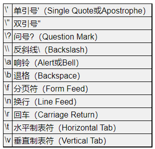

#  Linux C编程一站式学习笔记

[Linux C编程一站式学习 (akaedu.github.io)](http://akaedu.github.io/book/index.html)

##  一、程序基本概念

###  1、程序和编程语言

* 程序有一系列指令组成，通常包括以下几种：

  * 输入
  * 输出
  * 基本运算
  * 测试分支
  * 循环

* **编写程序可以说就是这样一个过程：把复杂的任务分解成子任务，把子任务再分解成更简单的任务，层层分解，直到最后简单得可以用以上指令来完成。**

* 平台的解释：

  * 计算机体系结构
  * 操作系统
  * 开发平台（编译器、链接器等）

* 编译（compile）过程

  

  * 用文本编辑器写一个C程序，然后保存成一个文件，例如`program.c`（通常C程序的文件名后缀是`.c`），这称为源代码（Source Code）或源文件，
  * 运行编译器编译源文件，编译的过程并不执行程序，而是把源代码全部翻译成机器指令，再加上一些描述信息，生成一个新的文件，例如`a.out`，这称为可执行文件
  * 可执行文件可以被操作系统加载运行，计算机执行该文件中由编译器生成的指令

* 解释（Interpret）过程

  

* 编程语言演化

  * 机器语言称为第一代语言（1GL，1st Generation Programming Language）
  * 汇编语言称为第二代语言（2GL，2nd Generation Programming Language）
  * C、C++、Java、Python等可以称为第三代语言（3GL，3rd Generation Programming Language）
  * 4GL（4th Generation Programming Language），例如SQL语言（SQL，Structured Query Language，结构化查询语言）
    * 4GL以后的编程语言更多是描述要做什么（Declarative）而不描述具体一步一步怎么做（Imperative）
  * 5GL（5th Generation Programming Language）

###  问题

1. 解释执行的语言相比编译执行的语言有什么优缺点?

> 解释执行的语言
>
> 优点：
>
> 1、解释执行不依赖于平台，因为编译器会根据不同的平台进行解析
>
> 2、开发速度快，出现严重BUG的几率小
>
> 缺点：
>
> 1、解析需要时间，不生成目标程序而是一句一句执行的方式会造成计算机资源的浪费，即执行效率低
>
> 2、解释语言需要把源代码交给用户

> 编译执行：
>
> 优点
>
> 1、相较于解释执行，编译执行的效率高，占用资源小，适合复杂程序
>
> 缺点：
>
> 兼容性差


##  二、自然语言和形式语言

* 1、自然语言：不是人为设计（虽然有人试图强加一些规则）而是自然进化的语言

  ​	  形式语言：为了特定应用而人为设计的语言

* 2、形式语言有严格的`语法`（Syntax）规则，语法规则是由`符号`（Token）和结构（Structure）的规则所组成的

  * Token的概念相当于自然语言中的单词和标点、数学式中的数和运算符、化学分子式中的元素名和数字
  * 结构是指Token的排列方式
  * 关于Token的规则称为`词法（Lexical）规则`，而关于结构的规则称为`语法（Grammar）规则`[^1]

* 3、自然语言和形式语言的区别：

  * 歧义性
  * 冗余性
  * 与字面意思的一致性（隐喻）

[^1]:很不幸，Syntax和Grammar通常都翻译成“语法”，这让初学者非常混乱，Syntax的含义其实包含了Lexical和Grammar的规则，还包含一部分语义的规则，例如在C程序中变量应先声明后使用。即使在英文的文献中Syntax和Grammar也常混用，在有些文献中Syntax的含义不包括Lexical规则，只要注意上下文就不会误解。另外，本书在翻译容易引起混淆的时候通常直接用英文名称，例如Token没有十分好的翻译，直接用英文名称。

##  三、程序的调试

* BUG类型
  * 编译时错误：导致编译器无法继续编译的错误。一般是语法错误。
  * 运行时错误：编译器检查不出，仍然可以生成可执行文件，但在运行时会出错而导致程序崩溃的错误
  * 逻辑错误和语义错误：可正常运行，但所实现的功能与设计不符。一般是程序的意思（即语义）是错的

##  四、第一个程序

程序实例

~~~C
#include <stdio.h>

/* main: generate some simple output */

int main(void)
{
	printf("Hello, world.\n");
	return 0;
}
~~~

将这个程序保存成`main.c`，然后编译执行：

~~~C
$ gcc main.c
$ ./a.out
Hello, world.
~~~

`gcc`是Linux平台的C编译器，编译后在当前目录下生成可执行文件`a.out`，直接在命令行输入这个可执行文件的路径就可以执行它。如果不想把文件名叫`a.out`，可以用`gcc`的`-o`参数自己指定文件名：

~~~C
$ gcc main.c -o main
$ ./main
Hello, world.
~~~

* 警告信息不是致命错误，编译仍然可以继续，如果整个编译过程只有警告信息而没有错误信息，仍然可以生成可执行文件
* 警告信息也是不容忽视的。出警告信息说明你的程序写得不够规范，可能有Bug，虽然能编译生成可执行文件，但程序的运行结果往往是不正确的
* **一个好的习惯是打开`gcc`的`-Wall`选项，也就是让`gcc`提示所有的警告信息，不管是严重的还是不严重的，然后把这些问题从代码中全部消灭**

###  习题

1、尽管编译器的错误提示不够友好，但仍然是学习过程中一个很有用的工具。你可以像上面那样，从一个正确的程序开始每次改动一小点，然后编译看是什么结果，如果出错了，就尽量记住编译器给出的错误提示并把改动还原。因为错误是你改出来的，你已经知道错误原因是什么了，所以能很容易地把错误原因和错误提示信息对应起来记住，这样下次你在毫无防备的情况下撞到这个错误提示时就会很容易想到错误原因是什么了。这样反复练习，有了一定的经验积累之后面对编译器的错误提示就会从容得多了。

##  五、以HelloWorld为例介绍部分编程规范

* 注释方式为`/**/`，可跨行，可穿插代码中，但**不可嵌套**

* `//`此注释方式是从C++中借鉴的语法，不可跨行，不可穿插

* 由双引号（Double Quote）引起来的一串字符称为字符串字面值（String Literal），或者简称字符串。

  > 程序的运行结果并没有双引号，`printf`打印出来的只是里面的一串字符`Hello, world.`，因此双引号是字符串字面值的界定符，夹在双引号中间的一串字符才是它的内容

  * 在程序中其他地方的空格、Tab和换行多一个少一个往往无关紧要，但有些场合有所要求或区别，例如，双引号中空格也算一个字符，`int`和`main`之间至少隔一个空格

* 转义字符

  

  * 转义序列有两个作用:
    * 把普通字符转义成特殊字符，例如把字母n转义成换行符
    * 把特殊字符转义成普通字符，例如\和"是特殊字符，转义后取它的字面值


##  六、常量（易忽略的知识点）

* 单引号只能括一个字符或一个转义序列，而双引号可以括一串字符串
* 字符串字面值中需使用转义序列才能打印出`''`，`""`，`?`，`\`，而字符常量既可以使用转义序列`\'`和`\?`，也可以直接用字符`""`和`?`，**而要表示'和\则必须使用转义序列**
* `printf`中的第一个字符串称为格式化字符串（Format String），它规定了后面几个常量以何种格式插入到这个字符串中
  * 在格式化字符串中%号（Percent Sign）后面加上字母c、d、f分别表示字符型、整型和浮点型的转换说明（Conversion Specification）
  * 转换说明只在格式化字符串中占个位置，并不出现在最终的打印结果中，这种用法通常叫做占位符（Placeholder）
* **转义序列是编译时处理的，而转换说明是在运行时调用`printf`函数处理的**

###  习题

1、总结前面介绍的转义序列的规律，想想在`printf`的格式化字符串中怎么表示一个%字符？写个小程序试验一下。

##  七、变量

* 定义：计算机存储器中的一块命名的空间，大小由类型决定
* 作用：存储一个值
* 特点：存储的值随时可变；需声明后使用
* 声明：可单独声明，同一类型的变量可同时声明

> **声明与定义**
>
> * C中声明（Declaration）有变量声明、函数声明和类型声明三种。
>
> * 一个变量或函数的声明要求编译器为它分配存储空间，那么也可以称为定义（Definition）
> * 声明一个类型是不分配存储空间的
> * 声明和语句类似，也是以;号结尾的，但是在语法上声明和语句是有区别的，语句只能出现在{}括号中，而声明既可以出现在{}中也可以出现在所有{}之外

* 变量名取名规则
  * 以字母或下划线_（Underscore）开头，后面可以跟若干个字母、数字、下划线，但不能有其它字符
  * 关键字（Keyword）或保留字（Reserved Word）不能用做标识符
  * **一般来说应避免使用以下划线开头的标识符**，以下划线开头的标识符只要不和C语言关键字冲突的都是合法的，但是往往被编译器用作一些功能扩展，C标准库也定义了很多以下划线开头的标识符
* 标识符：函数名、宏定义、结构体成员名、变量名等


##  八、赋值

* 定义：将值放入变量所代表的存储空间的过程

  ~~~C
  type varname = 值;
  ~~~

  此处`=`用作赋值，而不是等于

* `i=i+1` 在C语言中表示把变量`i`的存储空间中的值取出来，再加上1，得到的结果再存回`i`的存储空间中

* 在C语言中，`a=7`合法，`7=a`不合法

* 变量的定义和赋值也可以一步完成，这称为变量的初始化（Initialization）

* **初始化是一种特殊的声明，而不是一种赋值语句**

* 变量名用在等号左边表示赋值，而用在`printf`中表示把它的存储空间中的值取出来替换在那里

##  九、表达式

* 定义：由运算符和操作数所组成的算式

  * 操作数：参与运算的常量和变量

* 运算符优先级

  * 优先级高的先运算

  * 同一优先级的运算从左到右进行

  * | 类别       | 运算符                                 | 结合性   |
    | :--------- | :------------------------------------- | :------- |
    | 后缀       | () [] -> . ++ - -                      | 从左到右 |
    | 一元       | + - ! ~ ++ - -[^前缀] (type)* & sizeof | 从右到左 |
    | 乘除       | * / %                                  | 从左到右 |
    | 加减       | + -                                    | 从左到右 |
    | 移位       | << >>                                  | 从左到右 |
    | 关系       | < <= > >=                              | 从左到右 |
    | 相等       | == !=                                  | 从左到右 |
    | 位与 AND   | &                                      | 从左到右 |
    | 位异或 XOR | ^                                      | 从左到右 |
    | 位或 OR    | \|                                     | 从左到右 |
    | 逻辑与 AND | &&                                     | 从左到右 |
    | 逻辑或 OR  | \|\|                                   | 从左到右 |
    | 条件       | ?:                                     | 从右到左 |
    | 赋值       | = += -= *= /= %=>>= <<= &= ^= \|=      | 从右到左 |
    | 逗号       | ,                                      | 从左到右 |

    [^前缀]:此处++和--是前缀运算符，即`++a`、`--b`

  * ```
    括号成员是老大;      // 括号运算符 []() 成员运算符.  ->
    
    全体单目排老二;      // 所有的单目运算符比如++、 --、 +(正)、 -(负) 、指针运算*、&、sizeof
    
    乘除余三,加减四;    // 这个"余"是指取余运算即%
    
    移位五，关系六;     // 移位运算符：<< >> ，关系：> < >= <= 等
    
    等与不等排行七;     // 即 == 和 !=
    
    位与异或和位或;     // 这几个都是位运算: 位与(&)异或(^)位或(|)    
    
    "三分天下"八九十;  
    
    逻辑与，逻辑或;    // 逻辑运算符: || 和 &&
    
    十一十二紧挨着;    // 注意顺序: 优先级(||)  底于 优先级(&&) 
    
    条件只比赋值高,    // 三目运算符优先级排到 13 位只比赋值运算符和 "," 高
    
    逗号运算最低级!    //逗号运算符优先级最低 
    ```

  * **初等运算符>单目运算符>算术运算符>关系运算符>逻辑运算符>条件运算符>赋值运算符**

    

* 我们定义：在任意表达式后面加个;号也是一种语句，称为表达式语句

  ~~~C
  hour * 60 + minute;//仅运算，不保存计算结果
  
  int total_minute;
  total_minute = hour * 60 + minute;//运算且保存结果到total_minute中
  ~~~

* **任何表达式都有值和类型两个基本属性**

* > 如果一个表达式中出现多个等号，不是从左到右计算而是从右到左计算，例如：
  >
  > ```
  > int total_minute, total;
  > total = total_minute = hour * 60 + minute;
  > ```
  >
  > 计算顺序是先算`hour * 60 + minute`得到一个结果，然后算右边的等号，就是把`hour * 60 + minute`的结果赋给变量`total_minute`，这个结果同时也是整个表达式`total_minute = hour * 60 + minute`的值，再算左边的等号，即把这个值再赋给变量`total`。同样优先级的运算符是从左到右计算还是从右到左计算称为运算符的结合性（Associativity）。+ - * /是左结合的，等号是右结合的。

* > ```
  > printf("%d:%d is %d minutes after 00:00\n", hour, minute, hour * 60 + minute);
  > ```
  >
  > 编译器在翻译这条语句时，首先根据上述语法规则把这个语句解析成下图所示的语法树，然后再根据语法树生成相应的指令。语法树的末端的是一个个Token，每一步展开利用一条语法规则。
  >
  > **图 2.2. 语法树**
  >
  > 

* 左值和右值

  * 左值：表达式所表示的存储位置
  * 右值：表达式的值
  * **有的表达式既可以做左值也可以做右值，而有的表达式只能做右值**

* > 向下取整的运算称为Floor，用数学符号⌊⌋表示；向上取整的运算称为Ceiling，用数学符号⌈⌉表示。例如：
  >
  > ⌊59/60⌋=0
  > ⌈59/60⌉=1
  > ⌊-59/60⌋=-1
  > ⌈-59/60⌉=0
  >
  > **在C语言中整数除法取的既不是Floor也不是Ceiling，无论操作数是正是负总是把小数部分截掉，在数轴上向零的方向取整（Truncate toward Zero），或者说当操作数为正的时候相当于Floor，当操作符为负的时候相当于Ceiling。**


###  语法规则

* 表达式 → 标识符
* 表达式 → 常量
* 表达式 → 字符串字面值
* 表达式 → (表达式)
* 表达式 → 表达式 + 表达式
* 表达式 → 表达式 - 表达式
* 表达式 → 表达式 * 表达式
* 表达式 → 表达式 / 表达式
* 表达式 → 表达式 = 表达式
* 语句 → 表达式;
* 语句 → printf(表达式, 表达式, 表达式, ...);
* 变量声明 → 类型 标识符 = Initializer, 标识符 = Initializer, ...;（= Initializer的部分可以不写）

###  习题

1、假设变量`x`和`n`是两个正整数，我们知道`x/n`这个表达式的结果要取Floor，例如`x`是17，`n`是4，则结果是4。如果希望结果取Ceiling应该怎么写表达式呢？例如`x`是17，`n`是4，则结果是5；`x`是16，`n`是4，则结果是4。

~~~C
int quotient;
int x = 17,n = 4
    
方案一：//未验证，但感觉有点不对劲
quotient = ~(~x/n);

方案二：//未验证
quotient = (x+n-1)/n;

方案三：//未验证
quotient = x%m>0 ? x/n+1:x/n;
~~~


##  十、字符类型与字符编码

* 字符常量或字符型变量也可以当作整数参与运算，例如：

  ```c
  printf("%c\n", 'a'+1);
  ```

  执行结果是`b`。

* 符号在计算机内部也用数字表示，每个字符在计算机内部用一个整数表示，称为字符编码（Character Encoding），目前最常用的是ASCII码（American Standard Code for Information Interchange，美国信息交换标准码）

  * 常用字符

    | 字符 |   进制   |  数值  |
    | :--: | :------: | :----: |
    | 0—9  | 十六进制 | 30—39  |
    | A—Z  |  十进制  | 65—90  |
    | a—z  |  十进制  | 97—122 |

  * 字符也可以用ASCII码转义序列表示，这种转义序列由\加上1—3个八进制数字组成，或者由`\x`或大写`\X`加上1—2个十六进制数字组成，

##  十一、数学函数

* 小知识点
  * `1.0`是参数（Argument）
  * `log`是函数（Function）
  * `log(1.0)`是函数调用（Function Call）
  * 函数调用也是一种表达式，这个表达式由函数调用运算符（()括号）和两个操作数组成，操作数`log`是一个函数名（Function Designator），它的类型是一种函数类型（Function Type），操作数`1.0`是`double`型的。
  * `log(1.0)`这个表达式的值就是对数运算的结果，也是`double`型的，在C语言中函数调用表达式的值称为函数的返回值（Return Value）
* 语法规则：
  * 表达式 → 函数名
  * 表达式 → 表达式(参数列表)
  * 参数列表 → 表达式, 表达式, ...
* **C语言的函数可以有Side Effect，这一点是它和数学函数在概念上的根本区别**
  * 改变计算机存储单元里的数据或者做输入输出操作都算Side Effect
* 程序第一行的#号（Pound Sign，Number Sign或Hash Sign）和`include`表示包含一个头文件（Header File），后面尖括号（Angel Bracket）中就是文件名（这些头文件通常位于`/usr/include`目录下）。头文件中声明了我们程序中使用的库函数。
* 使用`math.h`中声明的库函数还有一点特殊之处，`gcc`命令行必须加`-lm`选项，因为数学函数位于`libm.so`库文件中（这些库文件通常位于`/lib`目录下），`-lm`选项告诉编译器，我们程序中用到的数学函数要到这个库文件里找

>  C标准库和glibc
>
> C标准主要由两部分组成，一部分描述C的语法，另一部分描述C标准库。C标准库定义了一组标准头文件，每个头文件中包含一些相关的函数、变量、类型声明和宏定义。要在一个平台上支持C语言，不仅要实现C编译器，还要实现C标准库，这样的实现才算符合C标准。不符合C标准的实现也是存在的，例如很多单片机的C语言开发工具中只有C编译器而没有完整的C标准库。
>
> 在Linux平台上最广泛使用的C函数库是`glibc`，其中包括C标准库的实现，也包括本书第三部分介绍的所有系统函数。几乎所有C程序都要调用`glibc`的库函数，所以`glibc`是Linux平台C程序运行的基础。`glibc`提供一组头文件和一组库文件，最基本、最常用的C标准库函数和系统函数在`libc.so`库文件中，几乎所有C程序的运行都依赖于`libc.so`，有些做数学计算的C程序依赖于`libm.so`，以后我们还会看到多线程的C程序依赖于`libpthread.so`。以后我说`libc`时专指`libc.so`这个库文件，而说`glibc`时指的是`glibc`提供的所有库文件。
>
> `glibc`并不是Linux平台唯一的基础C函数库，也有人在开发别的C函数库，比如适用于嵌入式系统的`uClibc`。

##  十二、自定义函数

* 语法规则：

  * 函数定义 → 返回值类型 函数名(参数列表) 函数体
  * 函数体 → { 语句列表 }
  * 语句列表 → 语句列表项 语句列表项 ...
  * 语句列表项 → 语句
  * 语句列表项 → 变量声明、类型声明或非定义的函数声明
  * 非定义的函数声明 → 返回值类型 函数名(参数列表);

* 函数调用的规则和优点

  * 同一个函数可以被多次调用。
  * 可以用一个函数调用另一个函数，后者再去调第三个函数。
  * 通过自定义函数可以给一组复杂的操作起一个简单的名字，例如`threeline`。对于`main`函数来说，只需要通过`threeline`这个简单的名字来调用就行了，不必知道打印三个空行具体怎么做，所有的复杂操作都被隐藏在`threeline`这个名字后面。
  * 使用自定义函数可以使代码更简洁

* 函数原型（Prototype）：比如`void threeline(void)`这一行，声明了一个函数的名字、参数类型和个数、返回值类型，这称为函数原型。在代码中可以单独写一个函数原型，后面加`;`号结束，而不写函数体，例如：

  ```c
  void threeline(void);//正真的函数原型
  void threeline();//不是函数原型
  ```

  这种写法只能叫函数声明而不能叫函数定义，只有带函数体的声明才叫定义

* 函数原型的作用：**为编译器提供了有用的信息**，编译器在翻译代码的过程中，只有见到函数原型（不管带不带函数体）之后才知道这个函数的名字、参数类型和返回值，这样碰到函数调用时才知道怎么生成相应的指令

* 函数调用原则：

  * 先声明后使用
  * 方式：
    * 按调用顺序编写函数
    * 通过函数原型进行声明，后续可以任意顺序进行函数编写
    * 如果不通过函数原型进行声明，先调用，后续编写函数，能编译通过，结果也正确，此处编译器认为此处**隐式声明**了`int threeline(void);`，**隐式声明的函数返回值类型都是`int`，由于我们调用这个函数时没有传任何参数，所以编译器认为这个隐式声明的参数类型是`void`**，这样函数的参数和返回值类型都确定下来了，编译器根据这些信息为函数调用生成相应的指令。然后编译器接着往下看，看到`threeline`函数的原型是`void threeline(void)`，和先前的隐式声明的返回值类型不符，所以报警告。好在我们也没用到这个函数的返回值，所以执行结果仍然正确
  
* 函数只能定义在函数外，不能定义在函数内

* 函数不允许重名，C语言中函数没有重载

* 函数只要一经定义，就可以在任意函数中调用

  注意：如果函数定义在它调用之后，那么必须在调用之前，先声明这个函数

* 声明的语法：返回值类型 函数名(参数列表);

  * tips:声明函数其实只要复制函数头，打个分号就可以了
  * 再注意： 1、函数定义的时候函数头是什么样子，那么声明的时候也必须是这个样子的
  * 2、如果有参数的函数，声明的时候可以省略形参名
  * 3、在Mac下，如果返回值类型是int的话，可以直接调用不声明(不推荐)
  * 4、函数的声明位置可以放在函数内，也可以放在函数外，但是一定要在调用函数之前
  * 5、函数的声明可以写N多个

[(3条消息) c语言声明函数格式 - CSDN](https://www.csdn.net/tags/MtjaQg0sOTgwMDgtYmxvZwO0O0OO0O0O.html)

###  问题

*  问：敏锐的读者可能会发现一个矛盾：如果函数`newline`没有返回值，那么表达式`newline()`不就没有值了吗？然而上一章讲过任何表达式都有值和类型两个基本属性

* 答：其实这正是设计`void`这么一个关键字的原因：首先从语法上规定没有返回值的函数调用表达式有一个`void`类型的值，这样任何表达式都有值，不必考虑特殊情况，编译器的语法解析比较容易实现；然后从语义上规定`void`类型的表达式不能参与运算，因此`newline() + 1`这样的表达式不能通过语义检查，从而兼顾了语法上的一致和语义上的不矛盾。

##  十三、形参和实参

* 形参（Parameter）：即形式参数，又称虚拟变量，是在定义函数名和[函数体](https://baike.baidu.com/item/函数体)的时候使用的参数,目的是用来接收调用该函数时传入的参数.

* 实参（Argument）：实际参数，是在调用时传递给函数的参数。实参可以是常量、变量、表达式、函数等，无论实参是何种类型的量，但必须具有确定的值。

* **实参的个数和数据类型必须和形参一一对应**

* **形参相当于函数中定义的变量，调用函数传递参数的过程相当于定义形参变量并且用实参的值来初始化**

* > ### Man Page
  >
  > Man Page是Linux开发最常用的参考手册，由很多页面组成，每个页面描述一个主题，这些页面被组织成若干个Section。FHS（Filesystem Hierarchy Standard）标准规定了Man Page各Section的含义如下：
  >
  > 
  >
  > **表 3.1. Man Page的Section**
  >
  > | Section | 描述                                                         |
  > | ------- | ------------------------------------------------------------ |
  > | 1       | 用户命令，例如`ls(1)`                                        |
  > | 2       | 系统调用，例如`_exit(2)`                                     |
  > | 3       | 库函数，例如`printf(3)`                                      |
  > | 4       | 特殊文件，例如`null(4)`描述了设备文件`/dev/null`、`/dev/zero`的作用 |
  > | 5       | 系统配置文件的格式，例如`passwd(5)`描述了系统配置文件`/etc/passwd`的格式 |
  > | 6       | 游戏                                                         |
  > | 7       | 其它杂项，例如`bash-builtins(7)`描述了`bash`的各种内建命令   |
  > | 8       | 系统管理命令，例如`ifconfig(8)`                              |
  >
  > 
  >
  > 注意区分用户命令和系统管理命令，用户命令通常位于`/bin`和`/usr/bin`目录，系统管理命令通常位于`/sbin`和`/usr/sbin`目录，一般用户可以执行用户命令，而执行系统管理命令经常需要`root`权限。系统调用和库函数的区别将在[第 2 节 “`main`函数和启动例程”](http://akaedu.github.io/book/ch19s02.html#asmc.main)说明。
  >
  > Man Page中有些页面有重名，比如敲`man printf`命令看到的并不是C函数`printf`，而是位于第1个Section的系统命令`printf`，要查看位于第3个Section的`printf`函数应该敲`man 3 printf`，也可以敲`man -k printf`命令搜索哪些页面的主题包含`printf`关键字。本书会经常出现类似`printf(3)`这样的写法，括号中的3表示Man Page的第3个Section，或者表示“我这里想说的是`printf`库函数而不是`printf`命令”。

###  问题

* 问：为什么参数不能和变量一样，相同类型变量一起定义，而是一个一个定义？

  即不遵循最少例外原则（Rule of Least Surprise）

* 答：

* 问：定义一个函数`increment`，它的作用是把传进来的参数加1。例如：

  ```
  void increment(int x)
  {
  	x = x + 1;
  }
  
  int main(void)
  {
  	int i = 1, j = 2;
  	increment(i); /* i now becomes 2 */
  	increment(j); /* j now becomes 3 */
  	return 0;
  }
  ```

  我们在`main`函数中调用`increment`增加变量`i`和`j`的值，这样能奏效吗？为什么？

* 答：

* 问：如果在一个程序中调用了`printf`函数却不包含头文件，例如`int main(void) { printf("\n"); }`，编译时会报警告：`warning: incompatible implicit declaration of built-in function ‘printf’`。请分析错误原因。

* 答：

##  十四、全局变量、局部变量和作用域

* 局部变量（Local Variable）：函数中定义的变量

  * 一个函数中定义的变量不能被另一个函数使用
  * 每次调用函数时局部变量都表示不同的存储空间。局部变量在每次函数调用时分配存储空间，在每次函数返回时释放存储空间。

* 全局变量（Global Variable）：定义在所有的函数体之外的变量

  * 在任何函数中都可以访问（使用）
  * 在程序开始运行时分配存储空间，在程序结束时释放存储空间

* 在程序运行过程中全局变量被读写的顺序从源代码中是看不出来的，源代码的书写顺序并不能反映函数的调用顺序。在某个不起眼的地方**对全局变量的读写顺序不正确一般会形成BUG。全局变量用起来很方便，但一定要慎用，能用函数传参代替的就不要用全局变量**

* 作用域：限定变量名的可用性的代码范围

* 局部变量和全局变量重名——根据作用域的范围判断，局部变量的作用域会覆盖全局变量的作用域

* **局部变量可以用类型相符的任意表达式来初始化，而全局变量只能用常量表达式（Constant Expression）初始化**

  ~~~C
  double pi = 3.14 + 0.0016;//合法
  double pi = acos(-1.0);//不合法
  int minute = 360;//合法
  int hour = minute / 60;//不合法
  ~~~

  

* 如果全局变量在定义时不初始化则初始值是0，如果局部变量在定义时不初始化则初始值是不确定的。所以，**局部变量在使用之前一定要先赋值**

* 非定义的函数声明也可以写在局部作用域中

* ### 问题

  ```
  #include <stdio.h>
  
  void foo(void)
  {
  	int i;
  	printf("%d\n", i);
  	i = 777;
  }
  
  int main(void)
  {
  	foo();
  	foo();
  	return 0;
  }
  ```

  结果：

  ```
  134518128
  777
  int main(void)
  {
  	foo();
  	printf("hello\n");
  	foo();
  	return 0;
  }
  ```

  结果是

  ```
  134518200
  hello
  0
  ```

  - 问：每次调用函数时局部变量都表示不同的存储空间，且局部变量不初始化则初值不确定，即每次调用这个函数时局部变量的初值可能不一样，运行环境不同，函数的调用次序不同，都会影响到局部变量的初值。问为什么这个不确定的值刚好是777，或者刚好是0？是恰好随机为777或0还是其他原因？
  - 答：


##  十五、if语句

* 控制表达式：`x != 0`表示“x不等于0”的条件

* 分支（Branch）：`if`和控制表达式改变了程序的控制流程（Control Flow），不再是从前到后顺序执行，而是根据不同的条件执行不同的语句，这种控制流程称为分支

* 小知识点

  * ==表示数学中的相等关系，相当于数学中的=号，在C语言中=号是赋值运算符
  * 如果表达式所表示的比较关系成立则值为真（True），否则为假（False），在C语言中分别用`int`型的1和0表示
  * `==`，`！=`，`>`，`<`，`>=`，`<=`运算符的两个操作数应该是相同类型的，两边都是整型或者都是浮点型可以做比较，但两个字符串不能做比较
  * ==和!=称为相等性运算符（Equality Operator），其余四个称为关系运算符（Relational Operator），相等性运算符的优先级低于关系运算符

* 和`if`语句相关的语法规则如下：

  语句 → if (控制表达式) 语句
  语句 → { 语句列表 }
  语句 → ;

* 在C语言中，任何允许出现语句的地方既可以是由;号结尾的一条语句，也可以是由{}括起来的若干条语句或声明组成的语句块（Statement Block），语句块和上一章介绍的函数体的语法相同

* 在C语言中一个单独的;号表示一条空语句（Null Statement）。

* **语句块中也可以定义局部变量**

  ```c
  void foo(void)
  {
  	int i = 0;
  	{
  		int i = 1;
  		int j = 2;
  		printf("i=%d, j=%d\n", i, j);
  	}
  	printf("i=%d\n", i); /* cannot access j here */
  }
  ```
  
  * 语句块中的变量`i`和函数的局部变量`i`是两个不同的变量，因此两次打印的`i`值是不同的
  * 语句块中的变量`j`在退出语句块之后就没有了，因此最后一行的`printf`不能打印变量`j`
  * 语句块可以用在任何允许出现语句的地方，不一定非得用在`if`语句中，单独使用语句块通常是为了定义一些比函数的局部变量更“局部”的变量

###  习题

* 问：在数学中`a<b<c`表示`b`既大于`a`又小于`c`，但作为C语言表达式却不是这样。以上几种运算符都是左结合的，问这个表达式应如何求值、

* 答：

* 问：以下程序段编译能通过，执行也不出错，但是执行结果不正确（根据[第 3 节 “程序的调试”](http://akaedu.github.io/book/ch01s03.html#intro.debug)的定义，这是一个语义错误），请分析一下哪里错了。还有，既然错了为什么编译能通过呢？

  ```c
  int x = -1;
  if (x > 0);
  	printf("x is positive.\n");
  ```

* 答：

##  十六、if/else语句

* C语言规定，*`else`总是和它上面最近的一个`if`配对*

  **Dangling-else问题：类似`if (A) if (B) C; else D;`形式的语句怎么理解呢？**可以理解成

  ```c
  //这是错的
  if (A)
  	if (B)
  		C;
  else
  	D;
  ```

  也可以理解成

  ```c
  //这是对的
  if (A)
  	if (B)
  		C;
  	else
  		D;
  ```

###  其他小知识点

* %运算符的结果总是与被除数同号

* 把语句封装成函数的基本步骤是：**把语句放到函数体中，把变量改成函数的参数**

* 浮点型的精度有限，不适合用==运算符做精确比较

###  问题

* 问：运算符的结果总是与被除数同号，为什么
* 答：
* 问：写两个表达式，分别取整型变量`x`的个位和十位
* 答：
* 问：写一个函数，参数是整型变量`x`，功能是打印`x`的个位和十位
* 答：

##  十七、布尔代数

* 布尔代数（Boolean Algebra）：关于逻辑运算的数学体系

* > 真和假用1和0表示，AND用*号表示，OR用+号表示（从真值表可以看出AND和OR运算确实有点像乘法和加法运算），NOT用¬表示，变量`x`、`y`、`z`的值可能是0也可能是1。
  >
  > ¬¬x=x
  >
  > x*0=0
  > x+1=1
  >
  > x*1=x
  > x+0=x
  >
  > x*x=x
  > x+x=x
  >
  > x*¬x=0
  > x+¬x=1
  >
  > x*y=y*x
  > x+y=y+x
  >
  > x*(y*z)=(x*y)*z
  > x+(y+z)=(x+y)+z
  >
  > x*(y+z)=x*y+x*z
  > x+y*z=(x+y)*(x+z)
  >
  > x+x*y=x
  > x*(x+y)=x
  >
  > x*y+x*¬y=x
  > (x+y)*(x+¬y)=x
  >
  > ¬(x*y)=¬x+¬y
  > ¬(x+y)=¬x*¬y
  >
  > x+¬x*y=x+y
  > x*(¬x+y)=x*y
  >
  > x*y+¬x*z+y*z=x*y+¬x*z
  > (x+y)*(¬x+z)*(y+z)=(x+y)*(¬x+z)


###  问题

* 问：

* 把代码段

  ```c
  if (x > 0 && x < 10);
  else
  	printf("x is out of range.\n");
  ```

  改写成下面这种形式：

  ```c
  if (____ || ____)
  	printf("x is out of range.\n");
  ```

  ____应该怎么填？

* 答：

* 问：

* 把代码段：

  ```c
  if (x > 0)
  	printf("Test OK!\n");
  else if (x <= 0 && y > 0)
  	printf("Test OK!\n");
  else
  	printf("Test failed!\n");
  ```

  改写成下面这种形式：

  ```c
  if (____ && ____)
  	printf("Test failed!\n");
  else
  	printf("Test OK!\n");
  ```

  ____应该怎么填？

* 答：

* 问：

* 有这样一段代码：

  ```c
  if (x > 1 && y != 1) {
  	...
  } else if (x < 1 && y != 1) {
  	...
  } else {
  	...
  }
  ```

  要进入最后一个`else`，x和y需要满足条件____ || ____。这里应该怎么填？

* 答：

* 问：

* 以下哪一个if判断条件是多余的可以去掉？这里所谓的“多余”是指，某种情况下如果本来应该打印`Test OK!`，去掉这个多余条件后仍然打印`Test OK!`，如果本来应该打印`Test failed!`，去掉这个多余条件后仍然打印`Test failed!`。

  ```c
  if (x<3 && y>3)
  	printf("Test OK!\n");
  else if (x>=3 && y>=3)
  	printf("Test OK!\n");
  else if (z>3 && x>=3)
  	printf("Test OK!\n");
  else if (z<=3 && y>=3)
  	printf("Test OK!\n");
  else
  	printf("Test failed!\n");
  ```

* 答：

##  十八、switch分支语句

* `switch`语句可以产生具有多个分支的控制流程。它的格式是：

  switch (控制表达式) {
  case 常量表达式： 语句列表
  case 常量表达式： 语句列表
  ...
  default： 语句列表
  }

* `case`后面跟表达式的必须是常量表达式，这个值和全局变量的初始值一样必须在编译时计算出来

* 浮点型不适合做精确比较，所以C语言规定`case`后面跟的必须是整型常量表达式

* 进入`case`后如果没有遇到`break`语句就会一直往下执行，后面其它`case`或`default`分支的语句也会被执行到，直到遇到`break`，或者执行到整个`switch`语句块的末尾

* 通常每个`case`后面都要加上`break`语句，但有时会故意不加`break`来利用这个特性，例如：

  **例 4.2. 缺break的switch语句**

  

* switch不是必不可缺的 ，可用一组`if ... else if ... else if ... else ...`代替
* 用`switch`语句会使代码更清晰
* 有时候编译器会对`switch`语句进行整体优化，使它比等价的`if/else`语句所生成的指令效率更高

##  十九、return语句

* 作用：提供整个函数的返回值，并结束当前函数返回调用它的地方

* **在没有返回值的函数中也可以使用`return`语句**，例如当检查到一个错误时提前结束当前函数的执行并返回：

  ```c
  #include <math.h>
  
  void print_logarithm(double x)
  {
  	if (x <= 0.0) {
  		printf("Positive numbers only, please.\n");
  		return;
  	}
  	printf("The log of x is %f", log(x));
  }
  ```

* 函数的返回值应该这样理解：**函数返回一个值相当于定义一个和返回值类型相同的临时变量并用`return`后面的表达式来初始化**
* **函数的返回值不是左值，或者说函数调用表达式不能做左值**
* 写带有`return`语句的函数时要小心检查所有的代码路径（Code Path）。有些代码路径在任何条件下都执行不到，这称为Dead Code
* **对程序中所有可能的情况分析得不够全面将导致漏掉一些代码路径，导致安静地退出函数，什么也不返回，C语言对于这种情况会返回什么结果是未定义的，通常返回不确定的值**

###  习题

* 问：编写一个布尔函数`int is_leap_year(int year)`，判断参数`year`是不是闰年。如果某年份能被4整除，但不能被100整除，那么这一年就是闰年，此外，能被400整除的年份也是闰年。
* 答：
* 问：编写一个函数`double myround(double x)`，输入一个小数，将它四舍五入。例如`myround(-3.51)`的值是-4.0，`myround(4.49)`的值是4.0。可以调用`math.h`中的库函数`ceil`和`floor`实现这个函数。
* 答：


##  二十、增量式开发

* **尽可能复用（Reuse）以前写的代码，避免写重复的代码**
* 解决问题的过程是把大的问题分成小的问题，小的问题再分成更小的问题，这个过程在代码中的体现就是函数的分层设计（Stratify）
* 上层函数通过调用底层函数来解决更大的问题，底层和上层函数都可以被更上一层的函数调用，最终所有的函数都直接或间接地被`main`函数调用
* 增量式开发：每写一行代码，验证，再继续编写
* 程序调试工具`gdb``
* ``printf`这个最原始的办法仍然是最直接、最有效的

##  二十一、递归

* 定义：自己调用自己，有最关键的基础条件（Base Case）

  * 没有基础条件的递归称为无穷递归
  * **写递归函数时一定要记得写Base Case，否则这个函数就会永远调用下去，直到操作系统为程序预留的栈空间耗尽程序崩溃（段错误）为止**

* **循环和递归是等价的**

* 栈（Stack）

* Leap of Faith

* “表达式”就是递归定义的：

  *表达式* → *表达式*(参数列表)
  参数列表 → *表达式*, *表达式*, ...

* “语句”也是递归定义的：

  *语句* → if (控制表达式) *语句*

###  习题

* 问：编写递归函数求两个正整数`a`和`b`的最大公约数（GCD，Greatest Common Divisor），使用Euclid算法：

  1. 如果`a`除以`b`能整除，则最大公约数是`b`。
  2. 否则，最大公约数等于`b`和`a%b`的最大公约数。

  Euclid算法是很容易证明的，请读者自己证明一下为什么这么算就能算出最大公约数。最后，修改你的程序使之适用于所有整数，而不仅仅是正整数。

* 答：

* 问：编写递归函数求Fibonacci数列的第`n`项，这个数列是这样定义的：

  fib(0)=1
  fib(1)=1
  fib(n)=fib(n-1)+fib(n-2)

  上面两个看似毫不相干的问题之间却有一个有意思的联系：

  - Lamé定理

    如果Euclid算法需要k步来计算两个数的GCD，那么这两个数之中较小的一个必然大于等于Fibonacci数列的第k项。

  感兴趣的读者可以参考[[SICP\]](http://akaedu.github.io/book/bi01.html#bibli.sicp)第1.2节的简略证明。

* 答：

##  二十二、while语句

* 迭代（Iteration）：重复反馈过程的活动，其目的通常是为了逼近所需目标或结果。每一次对过程的重复称为一次“迭代”，而每一次迭代得到的结果会作为下一次迭代的初始值
* 循环（Loop）：重复多次执行“判断控制表达式的值，为真时执行子语句”的控制流程
* 子语句称为**循环体**
* 累加器（Accumulator）：把每次循环的中间结果累积起来，循环结束后得到的累积值就是最终结果
* 循环变量（Loop Variable）：在循环中被改变且在控制表达式中要检测值的变量起控制循环次数的作用
* 函数式编程（Functional Programming）：在整个递归调用过程中，虽然分配和释放了很多变量，但所有变量都只在初始化时赋值，没有任何变量的值发生过改变
* 命令式编程（Imperative Programming）：在整个循环过程中，循环变量和累加器未被释放过，但内部存储的值多次发生改变，以获得最终结果
* **给变量多次赋值时要格外小心，在代码中多次读写同一变量应该以一种一致的方式进行**
* 无限循环（Infinite Loop）或者叫死循环

###  习题

* 问：3x+1问题
* 答：
* 问：用循环解决[第 3 节 “递归”](http://akaedu.github.io/book/ch05s03.html#func2.recursion)的所有习题，体会递归和循环这两种不同的思路
* 答：
* 问：编写程序数一下1到100的所有整数中出现多少次数字9。在写程序之前先把这些问题考虑清楚：
  1. 这个问题中的循环变量是什么？
  2. 这个问题中的累加器是什么？用加法还是用乘法累积？
  3. 在[第 2 节 “if/else语句”](http://akaedu.github.io/book/ch04s02.html#cond.ifelse)的习题1写过取一个整数的个位和十位的表达式，这两个表达式怎样用到程序中？
* 答：

##  do/while语句